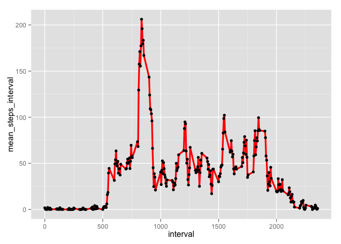

# Reproducible Research: Peer Assessment 1
Karan Sharma  
`r Sys.Date()`  

The following documents explains the data analysis undertaken as a part of the Reproducible Research Course in the Coursera-JHU Data Science Specialization. 

## Setup

In this section we setup R working environment by loading the required libraries. 


```r
library(data.table)
library(ggplot2)
```


## Loading and preprocessing the data

The provided data is in zipped, so firstly the data is unzipped. The resulting file is in CSV format and is titled *activity.csv*.

This file is then read into R and saved as a data frame titled *indata*. This data frame is then saved as a data.table object. For this assignment I use data.table library, for more information check data.table [cheat sheet](https://s3.amazonaws.com/assets.datacamp.com/img/blog/data+table+cheat+sheet.pdf).


```r
indata <- read.csv("./activity.csv")
setDT(indata)
```


The first and last five rows of the data are presented in the R output below:


```r
indata
```

```
##        steps       date interval
##     1:    NA 2012-10-01        0
##     2:    NA 2012-10-01        5
##     3:    NA 2012-10-01       10
##     4:    NA 2012-10-01       15
##     5:    NA 2012-10-01       20
##    ---                          
## 17564:    NA 2012-11-30     2335
## 17565:    NA 2012-11-30     2340
## 17566:    NA 2012-11-30     2345
## 17567:    NA 2012-11-30     2350
## 17568:    NA 2012-11-30     2355
```


## What is mean total number of steps taken per day?

1. To calculate the total number to steps taken per day, I use the data.table *by* feature to sum the total number of steps in a day. To ignore the missing values in the assignment, I set *na.rm=TRUE* in the sum function. As a result of this, days where steps were **NA** are treated as days where 0 (zero) steps were recorded. The head and tail of the resulting data.table *steps_perday* are shown in R output below:


```r
steps_perday <- indata[ ,.(total_steps= sum(steps,na.rm = TRUE)), by= date]

head(steps_perday,5)
```

```
##          date total_steps
## 1: 2012-10-01           0
## 2: 2012-10-02         126
## 3: 2012-10-03       11352
## 4: 2012-10-04       12116
## 5: 2012-10-05       13294
```

```r
tail(steps_perday,5)
```

```
##          date total_steps
## 1: 2012-11-26       11162
## 2: 2012-11-27       13646
## 3: 2012-11-28       10183
## 4: 2012-11-29        7047
## 5: 2012-11-30           0
```

\


2. Histogram of the total number of steps taken per day:


```r
hist.steps_perday <- ggplot(data = steps_perday, aes(total_steps)) + 
  geom_histogram(binwidth=2000,colour="red",fill="white")

print(hist.steps_perday)
```

 

\


3. Mean and Median of total number of steps taken per day:

```r
summary.steps_perday <- steps_perday[, .( mean_steps= mean(total_steps, na.rm = TRUE),
                                          median_steps= median(total_steps, na.rm = TRUE))
                                     ]
# Mean of total no. of steps taken per day:
summary.steps_perday$mean_steps
```

```
## [1] 9354.23
```

```r
# Median of total no. of steps taken per day:
summary.steps_perday$median_steps
```

```
## [1] 10395
```
So the **Mean** and **Median** of total no. of steps taken per day are **9354.23** and **10395** respectively.  

\


## What is the average daily activity pattern?

1. Calculating the average number of steps taken (averaged across all days) in all 5-minute intervals. Given that a day has 1440 minutes, we should have 288 five minutes intervals in a day.

2. The desired time-series plot is also presented in the R-code chunk below.

3. The 5 minute interval which contains the maximum number of steps (variable *max_interval* gives the value) is also calculated in the code chunk.


```r
avg_steps_interval <- indata[, .( mean_steps_interval= mean(steps, na.rm = TRUE)), by= interval]

# Average no. of steps in every interval across all days
print(avg_steps_interval)
```

```
##      interval mean_steps_interval
##   1:        0           1.7169811
##   2:        5           0.3396226
##   3:       10           0.1320755
##   4:       15           0.1509434
##   5:       20           0.0754717
##  ---                             
## 284:     2335           4.6981132
## 285:     2340           3.3018868
## 286:     2345           0.6415094
## 287:     2350           0.2264151
## 288:     2355           1.0754717
```

```r
# Time series
ts_avg_interval <- ggplot(data = avg_steps_interval, aes(x=interval, y=mean_steps_interval)) +
  geom_line(colour="red", size = 1.2) +
  geom_point(colour="black")

print(ts_avg_interval)
```

 

```r
# Which 5 minute interval contains the maximum number of steps (var= max_interval)
max_interval_index <- which.max(avg_steps_interval$mean_steps_interval) #calc the index
max_interval <- avg_steps_interval$interval[max_interval_index]

max_interval
```

```
## [1] 835
```

\


## Imputing missing values


## Are there differences in activity patterns between weekdays and weekends?
